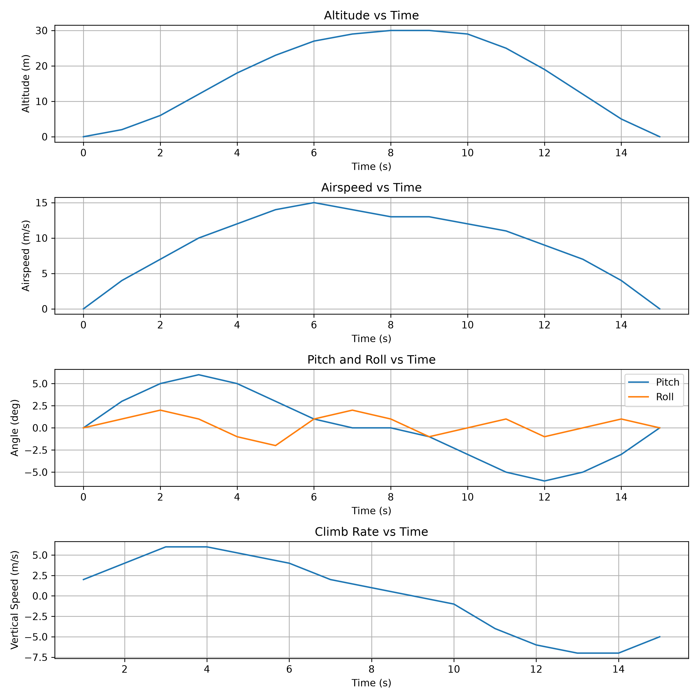

# UAV Flight Data Analyzer

A Python-based tool for analyzing UAV flight telemetry.

## Features

- Reads flight telemetry from CSV files
- Calculates climb and descent rate
- Detects basic flight phases:
  - Ground
  - Climb
  - Level Flight
  - Descent
- Detects takeoff and landing times
- Calculates airborne time
- Calculates flight performance metrics
- Quantifies attitude variation using pitch and roll standard deviation
- Generates a flight analysis dashboard
- Saves the dashboard automatically as an image

## Current Metrics

- Maximum altitude
- Maximum airspeed
- Average airspeed
- Maximum climb rate
- Maximum descent rate
- Roll standard deviation
- Pitch standard deviation
- Takeoff time
- Landing time
- Airborne time

## Technologies

- Python
- Pandas
- Matplotlib

## Future Improvements

- Import real ArduPilot flight logs
- GPS flight-path visualization
- Automated waypoint analysis
- Compare commanded vs actual trajectory
- Analyze real UAV stability and flight performance

## Example Output

